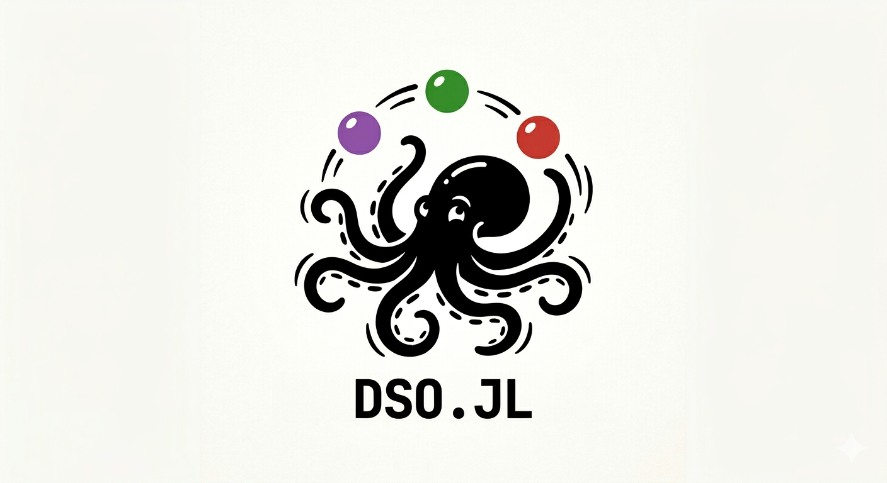

# DSO.jl

[](https://github.com/SMLMS/DSO.jl/actions/workflows/documentation.yml)

[](https://github.com/SMLMS/DSO.jl/actions/workflows/CI.yml)




[DSO](https://github.com/Boehringer-Ingelheim/dso), is a command line helper for building reproducible data analysis projects on top of dvc. To learn more about dso, please refer to the [dso documentation](https://boehringer-ingelheim.github.io/dso/). {DSO.jl} is the Julia companion package for dso. The purpose of this package is to provide access to files and configuration organized in a dso project.

## Installation

```julia
pkg> add https://github.com/SMLMS/DSO.jl
```

## 🛠️ Usage

### Flags & Options

- `here([rel_path])`: Returns the project root or a subpath.
- `stage_here([rel_path])`: Returns the absolute path to the current stage or a subpath.
- `set_stage(stage)`: Sets the current stage directory.
- `read_params([stage_path]; return_list=false)`: Loads parameters from YAML for a stage.

### Examples

DSO.jl provides convenient access to stage parameters from Julia scripts or notebooks. Using read_params the params.yaml file of the specified stage is compiled and loaded into a dictionary. The path must be specified relative to the project root – this ensures that the correct stage is found irrespective of the current working directory, as long as it the project root or any subdirectory thereof. Only parameters that are declared as params, dep, or output in dvc.yaml are loaded to ensure that one does not forget to keep the dvc.yaml updated.


```julia
using DSO

params_obj = read_params("subfolder/my_stage")


# Access parameters
params_obj.thresholds
params_obj.samplesheet

# get parameter keys
get_keys(params_obj)
```

By default, DSO compiles paths in configuration files to paths relative to each stage (see configuration). From Julia, you can use stage_here to resolve paths relative to the current stage independent of your current working directory. This works, because read_params has stored the path of the current stage in a configuration object that persists in the current Julia session. stage_here can use this information to resolve relative paths.


```julia
# Get project root
root = here()

# Set stage
set_stage("analysis")

# Get stage path
stage_path = stage_here()
```

Creating a stage within the Julia environment can be performed using {create} and supplying it with the relative path of the stage from project root and a description.

```Julia
create(
    "stage",
    dir="path/to/dir",
    name="AwesomeProject",
    description = "Some amazing analysis"
)
```

## Requirements

- Julia ≥ 1.10.10
- Dependencies: Dates, FilePathsBase, YAML

## 🧪 Testing

To verify the installation run: 

```julia
pkg> test
```


## 🐙 Further reading

More information about the DSO project as well as an R-companion can be found here:

* [Data Science Operations](https://github.com/Boehringer-Ingelheim/dso)
* [DSO R companion](https://github.com/Boehringer-Ingelheim/dso-r)

## 📚 Documentation

Check out the [Docs](https://SMLMS.github.io/DSO.jl/dev/) for the full API reference.

## ⚖️ License

MIT © Sebastian Malkusch